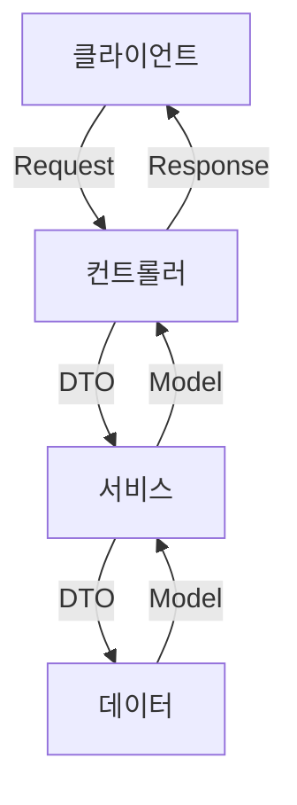

# Spring Core 8단계 ~ 10단계 구현 내용

## 레이어드 아키텍쳐 구현 방식

## 레이어별 직접 구현한 클래스

### 컨트롤러
`controller` 패키지에는 클라이언트의 요청을 수신하고, 요청 내용에 따라 적절한 서비스를 호출하는 컨트롤러가 위치한다. 요청을 처리한 후 그 결과를 클라이언트에 반환하는 역할을 담당한다.
* `ReservationController`
* `TimeController`

### 서비스
`service` 패키지는 컨트롤러로부터 전달받은 데이터를 기반으로 비즈니스 로직을 수행한다. 데이터 레이어와 상호작용하여 필요한 모델을 생성하거나 가져온 뒤, 그 결과를 컨트롤러에 반환한다.
* `ReservationService`
* `TimeService`

### 데이터
`dataLayer` 패키지는 `JdbcTemplate`을 활용하여 데이터베이스와 직접 통신하는 계층이다. 데이터배이스에 대한 작업을 담당한다.
* `ReservationRepository`
* `TimeRepository`
